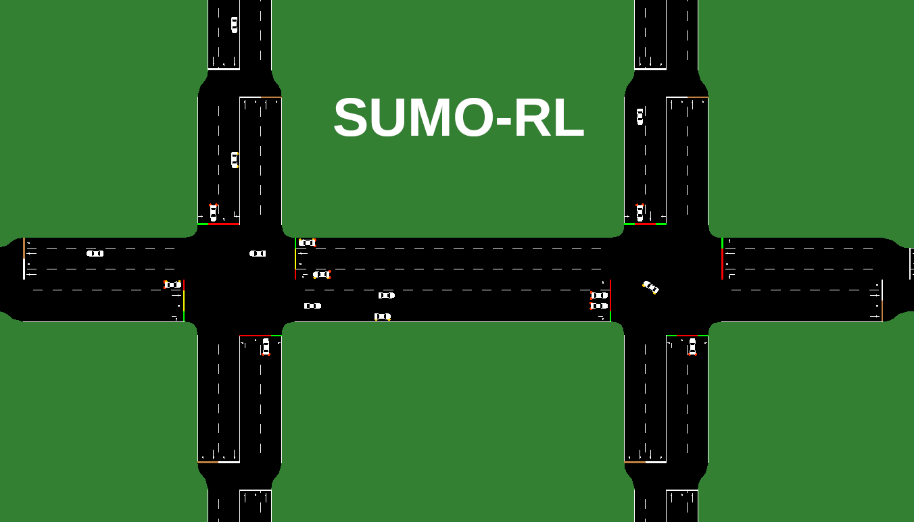
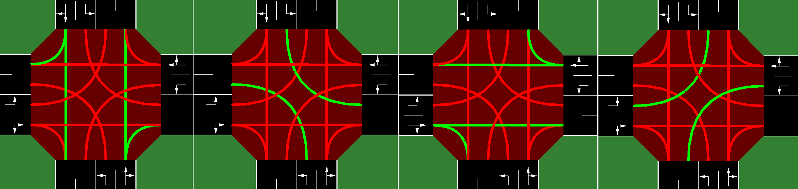
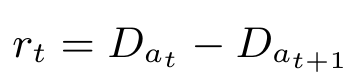
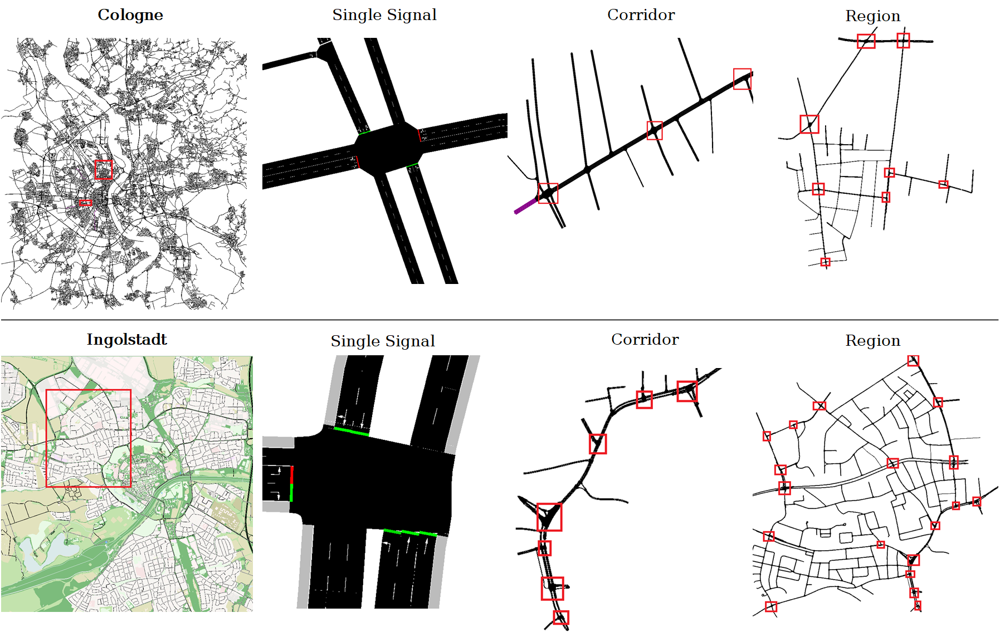

<p align="center">
  
</p>

# 🛡️ Simulateur Cyber-Physique VANET (VANET-RL-GAN)

[](https://www.python.org/downloads/)
[](https://github.com/psf/black)
[]()

Bienvenue dans le dépôt principal du **Simulateur Cyber-Physique VANET**. 

Ce projet est un banc d'essai avancé conçu pour évaluer la **résilience des réseaux de véhicules connectés et autonomes (VANET)** face à des défaillances réseau critiques et des cyberattaques (comme les attaques par Déni de Service Géolocalisé - Geo-DoS). Il hybride un moteur physique de trafic avec des algorithmes d'Intelligence Artificielle (Apprentissage par Renforcement Profond).

---

## 🎯 Objectifs du Système
- **Comportement "Fail-Safe" :** Entraîner une IA (Agent PPO) capable de sécuriser une intersection et d'éviter les collisions en cas de coupure brutale des communications V2X.
- **Réalisme Réseau :** Modélisation de la latence V2X avec du **Jitter Gaussien** pour éviter le surapprentissage (overfitting) et forcer la robustesse de l'IA face au bruit du monde réel.
- **Évolution Adversariale :** Préparation du terrain pour intégrer un modèle **GAN** capable d'apprendre à attaquer l'agent de défense de manière intelligente.

---

## ⚙️ Installation (Pour les membres de l'équipe)

### 1. Installation du Moteur Physique (SUMO)
Sous Linux (Ubuntu/Debian) :
```bash
sudo add-apt-repository ppa:sumo/stable
sudo apt-get update
sudo apt-get install sumo sumo-tools sumo-doc
```
> **Important :** N'oubliez pas de définir la variable d'environnement `SUMO_HOME`.
```bash
echo 'export SUMO_HOME="/usr/share/sumo"' >> ~/.bashrc
source ~/.bashrc
```
*(Pour Windows, assurez-vous que SUMO est installé via l'installateur officiel et que `SUMO_HOME` pointe vers `C:\Program Files (x86)\Eclipse\Sumo\`)*

### 2. Installation de l'Environnement VANET
Clonez ce dépôt et installez les dépendances en mode développeur :
```bash
git clone https://github.com/Tower0X/sumo-rl-gan.git
cd sumo-rl-gan
pip install -e .
pip install stable-baselines3[extra]
```

---

## 🚀 Prise en main (Guide de Démarrage)

Pour vous familiariser avec le projet, deux scripts principaux ont été préparés pour illustrer l'entraînement et l'évaluation de l'IA.

### 1. Entraîner le Cerveau Défensif (Agent PPO)
Ce script lance un entraînement rapide sans interface graphique pour générer le modèle PPO qui apprendra à gérer le trafic tout en minimisant les freinages d'urgence.
```bash
python train_vanet_ppo.py
```
> *Le modèle entraîné sera sauvegardé dans `outputs/ppo_vanet_model.zip`.*

### 2. Lancer la Simulation d'Attaque Cyber (Test Visuel)
Ce script ouvre l'interface **SUMO-GUI** et charge votre agent PPO. À la moitié de la simulation, une attaque **Geo-DoS** est artificiellement déclenchée (chute d'un RSU et perte de communication). Observez comment l'agent réagit pour prévenir les accidents.
```bash
python test_vanet_attack.py
```

---

## 🧠 Architecture de l'IA : Observation, Action et Récompense

### L'Espace d'Observation ("Ce que l'IA voit")
Contrairement aux simulateurs classiques, notre IA est "consciente du réseau". Elle reçoit un vecteur contenant :
- L'état actuel des feux et les files d'attente.
- **La Latence V2X :** Intègre un bruit stochastique (Gigue Gaussienne) pour simuler l'imperfection du canal sans fil.
- **Le Flag de Connexion (`comm_ok`) :** Indique si la communication avec l'infrastructure RSU est saine (1) ou brouillée/attaquée (0).

### L'Espace d'Action ("Ce que l'IA contrôle")
À chaque étape de temps, l'agent décide de l'organisation des feux ou des recommandations de vitesse.
<p align="center">

</p>

### La Fonction de Récompense Sécurisée ("Fail-Safe")
La fonction de récompense a été radicalement modifiée (cf. `_vanet_reward` dans `traffic_signal.py`) :
1. **Bonus :** Amélioration globale de la fluidité du trafic.
2. **Pénalité Critique :** Freinages d'urgence (décélération < -4.5 m/s²). L'IA apprend la souplesse.
3. **Pénalité d'Aveuglement :** Si le réseau est attaqué (`comm_ok = False`), l'accumulation de véhicules devient fortement pénalisée, forçant l'agent à adopter des mesures conservatrices pour vider la zone dangereuse.

<p align="center">

</p>

---

## 🗺️ Extension vers les Réseaux Multi-Intersections (MARL)

Le projet est conçu pour monter en échelle. Le dossier `nets/RESCO` contient des topologies allant de la simple intersection à des grilles complexes représentant de véritables cartographies urbaines (comme ci-dessous). L'objectif futur sera d'y déployer de multiples agents PPO coopératifs confrontés à des attaques GAN ciblées.

<p align="center">

</p>

---
*Ce projet est maintenu par l'équipe d'ingénierie Sécurité et IA. Pour toute contribution, veuillez créer une branche spécifique à votre tâche (ex: `feature/gan-attacker` ou `feature/marl-grid`).*
